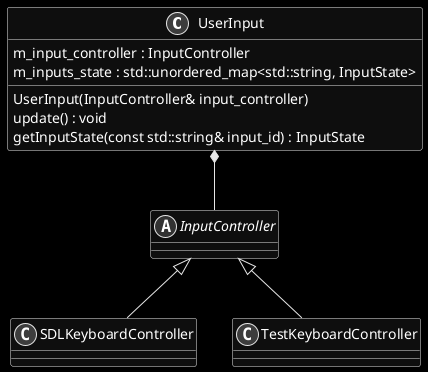
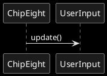

# Chip8 interpreter
## Input
The goal is to have a component which handle the input coming from the user. The solution should be generic enough to handle either a keyboard, an input from a touchpad or something else. 

In the logic of the interpeter, at each tick, an `update()` method is called. This method will update the current state of each input (`UP` or `DOWN`). If an instruction requires to check the state of a given input, it calls a method of the component with the `InputId` and gets the state of the given input.

It should satisfy the following requirements :

1. Provides a method to update the status of every inputs used in the interpreter.
2. Provides a method to check the status of a given key.
3. Independant from the library chosen to handle the input.
4. Generic enough to be used with other emulator (mostly different keys, different key mapping)

The class diagram is presented below. To ensure independance from the library used to get input or simply to have an easy way to test the component, an abstract class KeyboardController is used. Its role is to get the state of any key when performing the update.

## Sequence diagram
### Update of input

