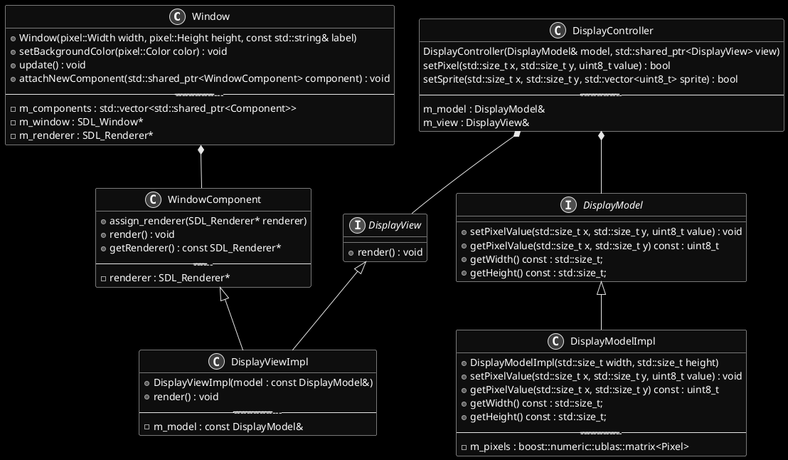
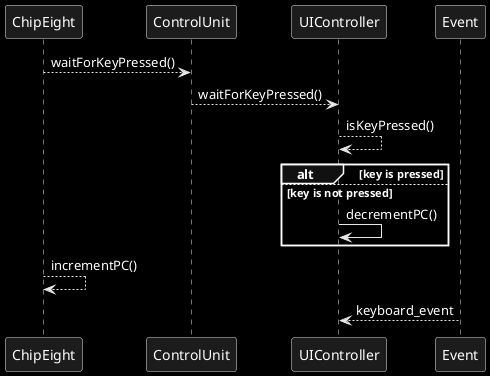
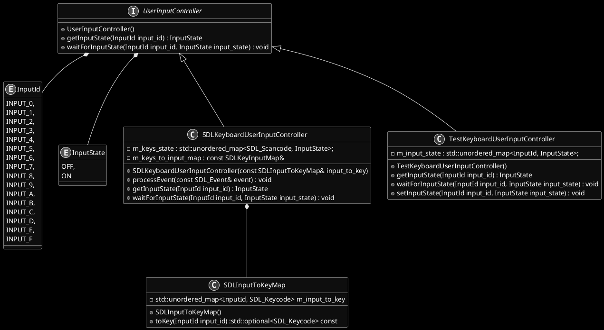

# Chip8 interpreter

## Instruction interpreter

```plantuml
@startuml 

skinparam monochrome reverse

start
if(first digit = 0) then (yes)
if(second digit = 0 & third digit = E) then (yes)
if (4th digit = 0) then (yes)
:Clear display;
else (no)
if (4th digit = E) then (yes)
:returnFromSubroutine;
else
:Jump to;
else
:Test;
@enduml
```

## Display



## Input
The goal is to have a component which handles the user inputs. Since the interpreter can be used on different platform (computer, but also smartphone, etc), the solution should be generic enough to handle either a keyboard, an input from a touchpad or something else. 

It should satisfy the following requirements :

1. Provide a method to update the status of every inputs used in the interpreter.
2. Provides a method to check the status of a given key.
3. Independant from the library chosen to handle the input.
4. Generic enough to be used with other emulator (mostly different keys, different key mapping)
5. Provide a wait for key press functionality (stops all execution while a key is not pressed)

There will be different layer in the system. At the level of the interpreter, each input is accessed through an `InputId`. For the chip8 it corresponds to the 16 keys originally used. At the level of input system (e.g SDL library) each input will be mapped to a key (`SDL_SCANCODE_*`). The mapping is dynamic since it could be modified by the user. 

The wait for key press functionality is ensured




